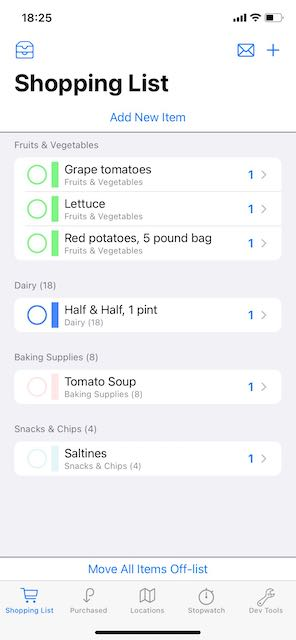
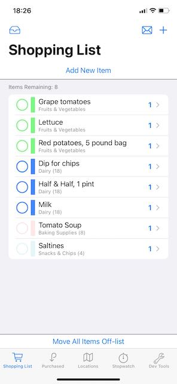
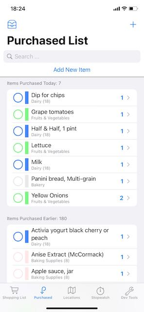
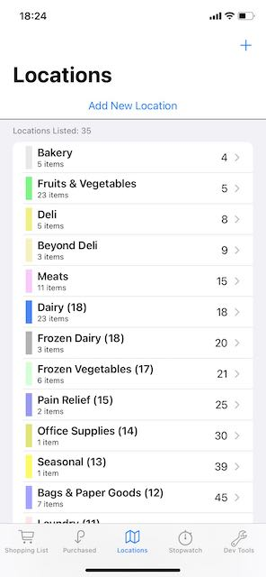

#  About "ShoppingList15"

ShoppingList15 is a simple iOS app to process a shopping list that you can take to the grocery store with you, and move items off the list as you pick them up.  It persists data in Core Data (optionally, synched across your personal devices using iCloud) and uses SwiftUI.  This project was posted using XCode 13.2 and requires iOS 15.0 or later.

* This repo was first made publicly available on 23 December, 2021.

* An [earlier version of this project](https://github.com/delawaremathguy/ShoppingList14) is available that works with XCode 12.5/iOS 14.5.  If you have not yet made the move to XCode 13/iOS 15, you should use this earlier project instead.

* An [even earlier version of this project](https://github.com/delawaremathguy/ShoppingList) is available that was posted with XCode 11.7/iOS 13.7. 

Feel free to use this as is, to develop further, to completely ignore, or even just to inspect and then send me a note or Open an Issue to tell me I am doing this all wrong.  

### Most Recent Update(s) of 2 February, 2022

* (*5 Feb*) Removed an extraneous addition of a navigation view when adding a new item to the Purchased List.
* (*2 Feb*) Fixed a major bug with the new strategy of adding and modifying shopping `Item`s that was having inconsistent editing results (*the most obvious of which was the inability to change an item's location*).  The `EditableItemData`is now an `@ObserveableObject` and the Add/Modify views treat these data as `@StateObject`s.  A similar change has been made in the Add/Modify views for Locations, to handle `EditableLocationData` also as `@StateObject`s.  It turns out that there is a major difference between using a `@State` struct or a `@StateObject` class in a View in terms of their lifetime.  You can read more in EditableItemData.swift and ModifyExistingItem.swift.

Please be sure to consult the ChangeLog below for all updates since the initial release of the project on 23 December, 2021.

## General App Structure

> *I still have to update these older screenshots (!)*

The main screen is a TabView, which presents *approximately*:

* a current shopping list (which can appear as a single section, or in multiple sections by Location) 

   

* a (searchable) list of previously purchased items, with one section showing items "purchased today" and a second section showing all other items 

   

* a list of "locations" in a store, such as "Dairy," "Fruits & Vegetables," "Deli," and so forth

 

* an in-store timer, to track how long it takes you to complete shopping (not shown), and

* a user Preferences tab, which also contains (for development purposes only) lets you load sample data that you can use to try out the app.

For the first two tabs, tapping on the circular button on the leading edge of an item's display moves a shopping item from one list to the other list (from "on the shopping list" to "purchased" and vice-versa).  

Tapping on any item (*not the leading circular button*) in either list lets you edit it for name, quantity, assign/edit the store location in which it is found, or even delete the item.  Long pressing on an item gives you a contextMenu to let you move items between lists, toggle between the item being available and not available, or directly delete the item.  (*Items not available will have a strike-through, italic presentation on screen*.)

The shopping list is sorted by the visitation order of the locations, and then alphabetically within each location.  Items in the shopping list cannot be otherwise re-ordered, although all items in the same Location have the same user-assignable color as a form of grouping.  

The shopping list has a "share" icon in the navigation bar that will bring up a share sheet, so that you can send off a copy of your list by email, text, or social media.

The shopping list and the purchased item list have buttons in the header of the first section to toggle the display from a simple, one-section list, to a multi-section list.  For the shopping list, a multi-section display is broken out by Location; for the purchased item list, a multi-section display is broken out by items purchased "today" and then by those purchased earlier.

The third tab shows a list of all locations, each having a visitation order (an integer from 1...100, as in, go to the dairy first, then the deli, then the canned vegetables, etc).  One special Location is the "Unknown Location," which serves as the default location for all new items.  I use this special location to mean that "I don't really know where this item is yet, but I'll figure it out at the store." The unknown location has the highest of all visitation order values, so that it comes last in the list of Locations, and shopping items with this unknown location will come at the bottom of the shopping list. 

Tapping on a Location in the list lets you edit location information, including reassigning the visitation order, changing its color, or deleting it.  In this updated version, the color is settable using the ColorPicker available in iOS 14.  You will also see a list of the Items that are associated with this Location. A long press on a location (other than the "unknown location") will allow you to delete the location directly.

* What happens to Items in a Location when the Location is deleted?  The Items are not deleted, but are moved to the Unknown Location.

The fourth tab is an in-store timer, with three simple button controls: "Start," "Stop," and "Reset."  This timer does *not* pause when the app goes into the background -- e.g., if you pull up a calculator or take a phone call while shopping. (*See GlobalTimer.swift if you wish to change this behaviour*.)

Finally, there is a Preferences tab that contains two areas:

* one that's intended for production, where you can change the user default value for the number of days used to section out the PurchasedTabView;
* the other for "development-only" purposes, to allow wholesale loading of sample data and offloading data for later use. This area should be hidden for any production version of the app (*see Development.swift to hide this*).

Here's what you do next:

* **If you would like to test out this app and decide if it might be of interest to you**, run it on the simulator, go straight to the Preferences tab on startup and tap the "Load Sample Data" button.  Now you can play with the app.

* **If you plan to install and use this app on your own device**, the app will start with an empty shopping list and a location list having only the special "Unknown Location"; from there you can create your own shopping items and locations associated with those items.  (*Hint: add Locations before adding Items!*)  I would suggest that you remove the development-only portion of the Preferences tab before installing the app (see comments in Development.swift).

### Core Data Notes

There have been no changes to the Core Data model since [ShoppingList14](https://github.com/delawaremathguy/ShoppingList14). 

### App Architecture

Unfortunately, what has always bothered me about the current state of SwiftUI view code that I see that uses @FetchRequest is that such a view often needs to understand that the data it processes come from Core Data.  The view must also may need to know some of the gritty details of Core Data (e.g. @FetchRequests needed to know about sortDescriptors and keyPaths) and possibly know when to either nil-coalesce or at least test for nil values.

The design in this app now lives somewhere between MVVM and a basic, @FetchRequest-driven SwiftUI app structure.  My goal in reaching the current code structure was that all SwiftUI views should follow **these three rules**: 

* a View should never "really" know that its data comes from Core Data (*no use of Core Data keypaths or managedObjectContexts*);

* a View should never access or manipulate attributes of a CD object directly; and

* the associated "View.swift" file that defines the View should never have to  `import CoreData`.  

The code of this app **continues to follow the three rules above**, and I think the result works quite well.  

## License

* The app icon was created by Wes Breazell from [the Noun Project](https://thenounproject.com). 
* The extension I use on Bundle to load JSON files is due to Paul Hudson (@twostraws, [hackingwithswift.com](https://hackingwithswift.com)) 
* The Activity View Controller/Share Sheet is implemented using the open-source ActivityView framework and SwiftUI package [available at SwiftUI+](https://github.com/SwiftUI-Plus), Copyright © 2020 [Shaps Benkau](https://benkau.com)

Otherwise, just about all of the code is original, and it's yours if you want it -- please see LICENSE for the usual details and disclaimers.

## ChangeLog

This third iteration of my ShoppingList project will continue to serve as my learning environment for what most people call "SwiftUI 3," the version of SwiftUI released with iOS 15, and I will try to use new features available in iOS 15 whenever I can.

Major code-level changes that you will find in this release of the project are:

* Cloud-syncing across devices on the same Apple ID is implemented.  You can build the list on your iPad, then take your iPhone to the store with the updated list.

  * The proper cloud entitlements have been added to this project; but to actually turn on Cloud-syncing, you will need an Apple Developer account, you will need to manage app signing, and you must specify your own bundle identifier.  See comments in PersistentStore.swift.  *A small amount of testing may still be necessary.*

* I have separated what were dual-purpose "AddOrModify" views for both Items and Locations so that we now have a "ModifyExisting" view that is presented via a NavigationLink, and an "AddNew" view that is brought up by a sheet. 

* Alerts and sheets may now prefer to use a presentation syntax of `.alert(item:)` or `.sheet(item:)`, using a slightly newer design pattern based on class objects for the necessary identifiable items (*rather than structs having protocol requirements as in ShoppingList14*).  There is an obvious advantage here -- once you "get" the implementation idea, that every such item is a little bit of a "view model" to drive an alert or sheet, any one view can use a single `.alert` or `.sheet` modifier based on a single `@State` variable to handle any number of possible alerts and sheets, depending on how you set up the (Identifiable) variable.  So the "one alert/one sheet per view" restriction of SwiftUI can often be circumvented with this design pattern.

* The functionality of what was SearchBarView (by Simon Ng) has been replaced using the iOS 15 native `.searchable()` view modifier.

* Sharing of a shopping list is now implemented using a standard "share sheet," i.e., a UIActivityViewController, using a SwiftUI package from [SwiftUI+](https://github.com/SwiftUI-Plus). 

* The coding for the display of Items in each of the shopping list and purchased list views has, thankfully, been cleanly merged, removing what was an irritating example of needless code duplication. 

* Comments throughout the code have undergone some cleaning.

* UI changes: 

  * The "Add New Item/Location" button at the top of the ShoppingList, PurchasedItems, and Locations view have been removed.  Each screen already has a "+" at the top, right of the screen to add a new shopping item or location.
  * The "Mark All Items Available" and "Move All Items Off-list" buttons on the shopping list view are now in an HStack (not a VStack), with some animation aiding the transition if the "Mark All Items Available" button need not appear.
  * The single-section versus multi-section display button, previously shown as a leading navigation button, now appears as a button in the header of the first section in both the ShoppingListView and PurchasedItemsView.
  
Subsequent initial-release-fixes:

* (*24 Dec*) Reinstated the required `.sheet` modifier on ShoppingListView so that you can really add a new item after tapping the `+` button in the navigation bar (duh!)
* (*24 Dec*) Fixed a little bit of a bug caused by a misunderstanding on my part in ModifyExistingItemView that now requires me to keep a reference to an Item.
* (*26 Dec*) Cloud sharing is off by default, to avoid confusion.  See comments in PersistentStore.swift.
* (*29 Dec*) The share icon in the ShoppingListView is now disabled if there are no items on the shopping list.
* (*29 Dec*) Functions Item.update(using:) and Location.update(using:) have been renamed to "updateAndSave," since they save the context as well as update.
* (*29 Dec*) I have added a few explicit saves of the managedObjectContext.  Example: tap an item off one list to another, so that the cloud is more likely to get the change as well sooner, rather than later.
* (*29 Dec*) ~There appears to be a layout problem for the ActivityView on the iPad when in a regular environment.  I am still looking at this, but the workaround for now is to be sure that you are in a compact environment (e.g., in a split screen with ShoppingList in a compact half of the screen).~
* (*29 Dec*) Version number changed to 3.0.
* (*2 Jan*) Sharing of shopping list (simple text) is disabled if MFMessageComposeViewController.canSendText() == false.
* (*10 Jan*) Removed the `!MFMessageComposeViewController.canSendText()` qualifier on whether the share icon is disabled on the ShoppingListView so this can work in the simulator. (`canSendText()` does not refer to whether the activity item can be text, but whether the device can text.)
* (*11 Jan*) Moved the `.activitySheet($activityItem)` modifier in the ShoppingListView from the enclosing view to the share button in the navigation bar, and this seems to clear up earlier issues with iPad presentation.  In short:The placement of the `.activitySheet` modifier determines the view on an iPad to which the UIActivityViewController will be attached.
